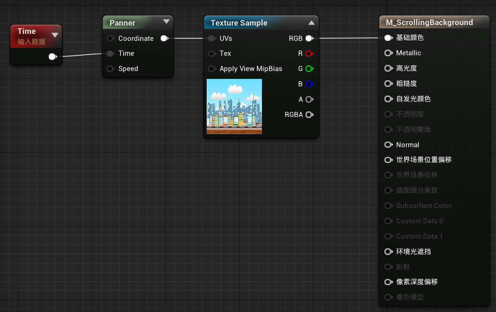
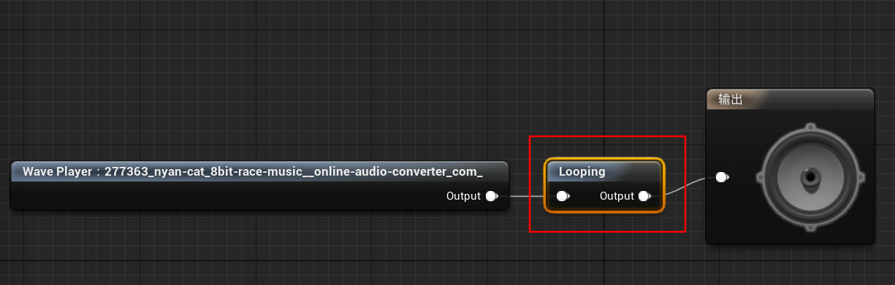
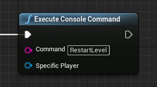

1. 滚动背景的实现使用Material表达式。思路是通过不断改变Texture的UV坐标从而达到滚动的效果。UE4提供了一个Panner表达式可以直接使用。
   
2.  Cube如何循环播放的问题。
   双击Cude资源，然后在编辑器中添加Looping节点。
   
3. 关卡重启的方法。
   一种是重新加载Level的方法，使用控制台命令RestartLevel。关卡的加载是在UEngine::LoadMap()方法中实现的。
   
   这个方法比较简单暴力。
   另外一种是通过调用[AGameModeBase::ResetLevel](https://docs.unrealengine.com/en-US/API/Runtime/Engine/GameFramework/AGameModeBase/ResetLevel/index.html)方法，然后所有相关的Actor把需要重置的操作写在Reset()方法中。这种方法可以实现关卡重启但不需要重新加载关卡。